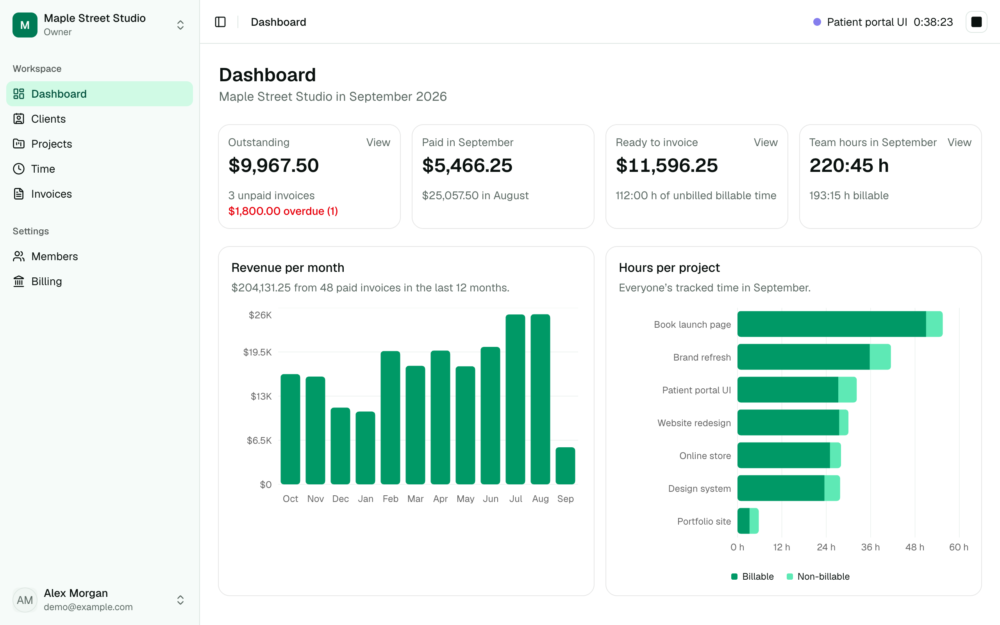
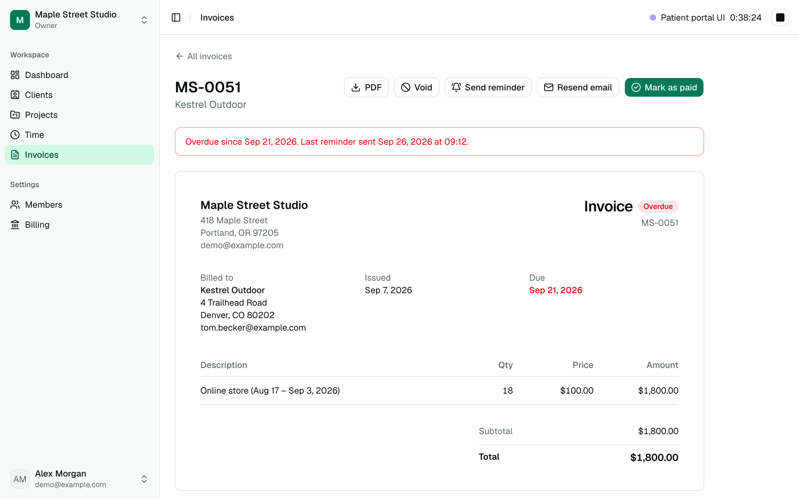
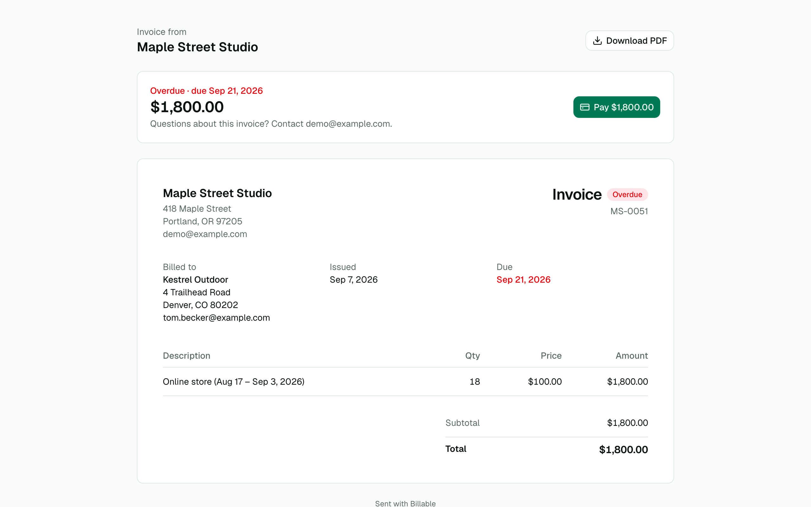
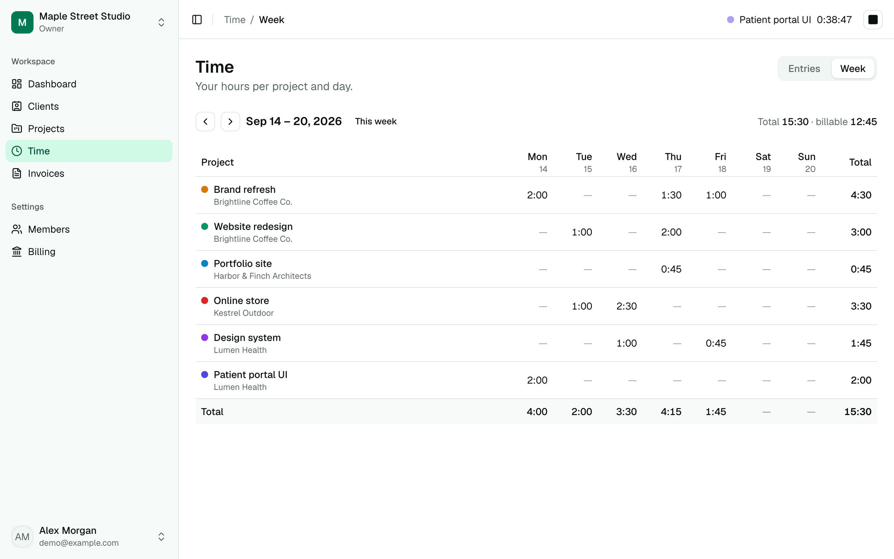
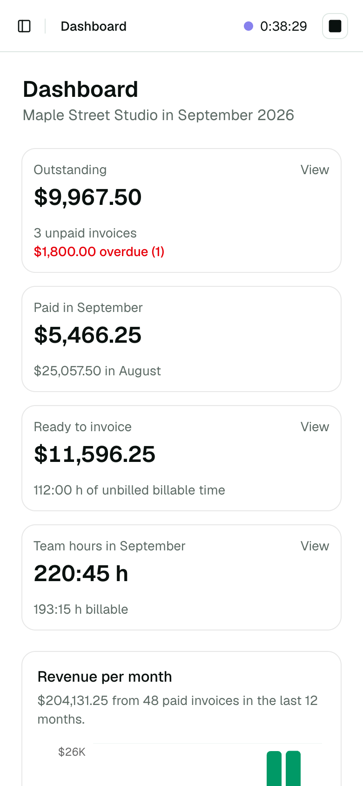
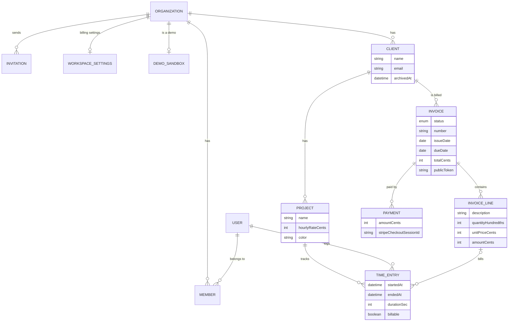

# Billable

**Track time. Send invoices. Get paid.** A multi-tenant SaaS for freelancers and small studios:
manage clients and projects, track billable hours, turn them into invoices, and let clients pay
online with Stripe.

**[Live demo →](https://saa-s-billable.vercel.app)** Click **Try the demo**: you get your own workspace
full of sample data, no sign-up needed. Payments run in Stripe test mode (card
`4242 4242 4242 4242`, any future date, any CVC).



## Features

- **Workspaces and teams:** each workspace is isolated; invite teammates by email as admins or
  members; switch between workspaces.
- **Clients and projects:** hourly rates, colors, search, archive and restore.
- **Time tracking:** a one-click timer that follows you across pages, manual entries on your own
  clock (daylight-saving safe), and a weekly timesheet.
- **Invoices:** created from unbilled time in a few clicks, numbered when sent, emailed with a PDF
  attached, and shared through a private link the client opens without an account.
- **Online payments:** the client pays on Stripe's hosted Checkout; a signed webhook marks the
  invoice paid.
- **Payment reminders** for overdue invoices, at most one a day.
- **Dashboard:** outstanding and overdue amounts, revenue per month, unbilled time and hours per
  project.
- **Roles:** owners and admins manage clients, invoices and money; members track their own time.
- **One-click demo:** every visitor gets a private sandbox that's deleted after 24 hours.

| Invoice (owner's view) | What the client sees |
| --- | --- |
|  |  |

| Weekly timesheet | On a phone |
| --- | --- |
|  |  |

## Tech stack

| | |
| --- | --- |
| Framework | Next.js 16 (App Router, Server Components, Server Actions), React 19, TypeScript |
| Database | PostgreSQL with Prisma 7 (multi-file schema, hand-written CHECK constraints) |
| Auth | Better Auth: email and password, email verification, password reset, organizations and roles |
| UI | Tailwind CSS 4, shadcn/ui on Base UI, Recharts, lucide icons |
| Payments | Stripe Checkout and webhooks |
| Email and PDF | Nodemailer with React Email templates, @react-pdf/renderer |
| Dates | date-fns 4 and @date-fns/tz |
| Validation | Zod 4, shared by forms and Server Actions |
| Quality | Vitest, ESLint, Prettier, GitHub Actions |
| Hosting | Vercel, Prisma Postgres, Resend (SMTP) |

## How it's built

The full picture is in [docs/ARCHITECTURE.md](docs/ARCHITECTURE.md), and the reasoning behind
each choice in [docs/DECISIONS.md](docs/DECISIONS.md). The highlights:

- **Tenant isolation in three layers.** Workspaces live in the URL (`/acme/invoices`). Every page
  and service function starts with a membership check, every query is scoped by the workspace,
  and composite foreign keys (`project(clientId, organizationId)` → `client(id, organizationId)`)
  make the database itself reject cross-workspace links.
- **A service layer.** Pages and Server Actions call `server/*`, which checks the session and
  role before touching data. Actions validate every input with Zod, including values the page
  bound to them, since those come from the browser too.
- **Money as integers.** Amounts are stored in cents and quantities in hundredths, and typed
  amounts are parsed as text, so there are no floating-point errors.
- **Invoices behave like real invoices.** A draft gets its number only when sent, from a
  row-locked counter, so numbers never have gaps. Sender and client details are snapshotted on
  sending, so later edits don't change an issued invoice. Overdue is computed, never stored.
- **Payments are idempotent.** Both the Stripe webhook (signature-checked on the raw body) and the
  return page record a payment. A unique Checkout session id makes double recording impossible,
  and amount and currency are checked against the invoice.
- **Time zones done carefully.** Times are stored in UTC and shown on the user's clock. Calendar
  maths (weeks, months, "today") uses date-fns in the user's zone. Skipped and repeated
  daylight-saving hours are handled, and tests run with the server in more than one time zone.
- **Concurrency is handled by the database.** A partial unique index allows one running timer per
  user. Claiming time for an invoice uses a conditional update. Reminders are claimed before they
  are sent, so double clicks send one email.
- **A demo that can't be abused.** Each "Try the demo" click seeds a fresh sandbox in one
  transaction (~200 ms). Old sandboxes are cleaned up after responses are sent, with no cron job
  needed. Demo workspaces never send email.

<details>
<summary><strong>Data model</strong></summary>



</details>

### Project structure

```
app/            routes: (marketing), (auth), (app)/[orgSlug]/…, public invoice /i/[token], API routes
components/     shared UI (shadcn/ui in components/ui)
server/         service layer: data access and business rules
lib/            code built on a package: auth, database, mailer, Stripe, dates, PDF
utils/          plain TypeScript helpers: money, invoice maths, slugs, redirects
validations/    Zod schemas
emails/         React Email templates
prisma/         multi-file schema, migrations, seed
tests/unit/     Vitest
docs/           ARCHITECTURE.md, DECISIONS.md, screenshots
```

## Running locally

You need **Node.js 24** and **Docker**.

```bash
git clone https://github.com/CodeForLazar/SaaS-Billable.git
cd SaaS-Billable
npm install                  # also generates the Prisma client
cp .env.example .env         # then set BETTER_AUTH_SECRET: openssl rand -base64 32
docker compose up -d         # Postgres 18 + Mailpit (a local inbox)
npm run db:deploy            # create the tables
npm run db:seed              # optional: a demo workspace, sign in as demo@example.com / demo-password
npm run dev                  # http://localhost:3000
```

Emails (sign-up confirmation, invitations, invoices) land in Mailpit at http://localhost:8025.
To test payments, add a Stripe test key to `.env` and forward webhooks with the Stripe CLI (see
`.env.example`).

| Script | What it does |
| --- | --- |
| `npm run dev` | Development server |
| `npm test` / `npm run test:watch` | Unit tests (Vitest) |
| `npm run typecheck` | Generates Next's route types, then runs `tsc` |
| `npm run lint` / `npm run format` | ESLint / Prettier |
| `npm run db:migrate` | Create and apply a migration after a schema change |
| `npm run db:studio` | Browse the database |
| `npm run email:dev` | Preview the email templates |

## Tests and CI

Unit tests cover the logic where bugs hide: time zones and daylight saving, money parsing,
invoice maths, overdue status, permissions, the open-redirect guard and validation. GitHub Actions
runs on every push and pull request:

- formatting, lint, types, the unit tests (twice, with the server in two time zones) and a
  production build;
- every migration on an empty Postgres, a check that fails when the schema has changes without a
  migration, and the demo seed.

## Deployment

Hosted on Vercel. On production deploys the `vercel-build` script applies pending migrations
before building. The environment variables are listed in [`.env.example`](.env.example).
